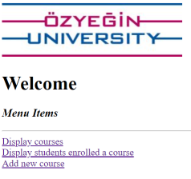
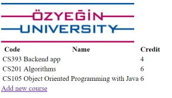
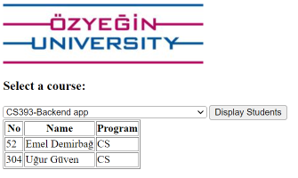
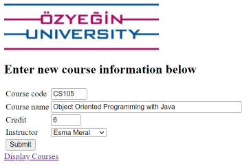

# ozu-CS393-2023-2024-Fall Web Application Example

## Before running web application
- Start Derby database
- Start backend application
- For calling RestFul services from JavaScript you must add @CrossOrigin annotation to the @RestController classes

## Main Page

## Display Course Page

## Display students

## Create Course Page
